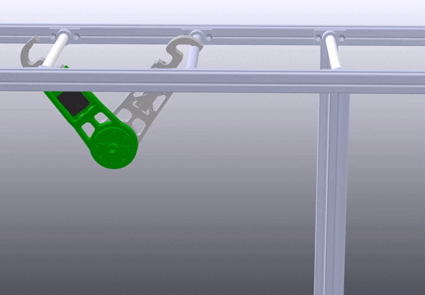
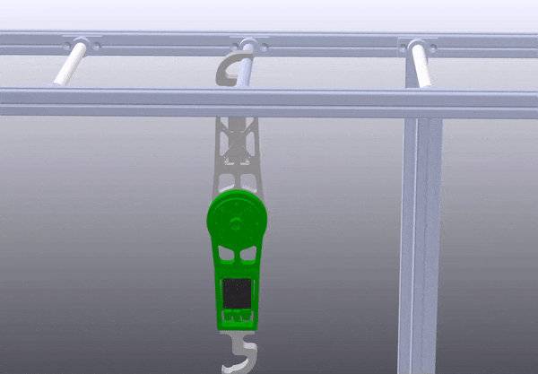
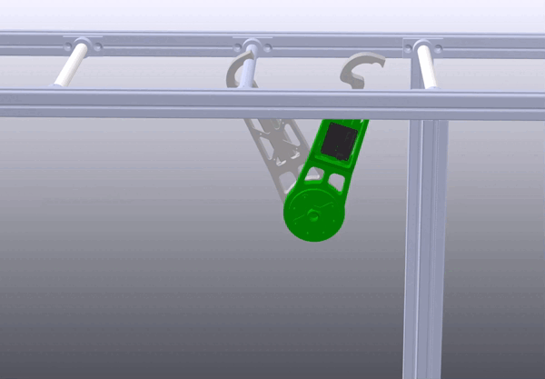

# AcroMonk: A Minimalist Underactuated Brachiating Robot

## Description
This project offers an open-source and low-cost kit to test control algorithms 
for underactuated robots. 
it implements a **brachiation robot** platform called **AcroMonk** which 
can brachiate robustly over a horizontally laid ladder bar. AcroMonk is 
the simplest possible underactuated brachiator built using one quasi-direct 
drive actuator (QDD) and passive grippers. This is the first brachiator with 
unactuated grippers that can perform more than two brachiation maneuvers. 
This project offers different control methods for trajectory stabilization 
which can be studied using the kit. Additionally, it provides a list of 
components, discusses best practices for implementation, and presents results 
from experiments with the simulator and the real system. This repository 
describes the hardware (CAD, Bill Of Materials (BOM) etc.) required to build 
the physical system and provides the software (URDF models, simulation and 
controllers) to control it.

## Documentation

The [hardware setup](hardware/testbench-description.md), [motor configuration](hardware/motor-configuration.md) and [sensor reading](hardware/imu-sensor-reading.md) are described in their respective readme files.
The dynamics of the AcroMonk is explained [here](docs/acrm-equations.md).

* [Hardware & Testbench Description](hardware/testbench-description.md)
* [Motor Configuration](hardware/motor-configuration.md)
* [IMU Sensor Reading](hardware/imu-sensor-reading.md)
* [Bill Of Materials (BOM)](docs/bills-of-materials.md)

## Authors #

* [Shivesh Kumar](https://robotik.dfki-bremen.de/en/about-us/staff/shku02.html) (Project Supervisor)
* [Mahdi Javadi](https://robotik.dfki-bremen.de/en/about-us/staff/maja04/) (Hardware and Software Maintainer)
* [Daniel Harnack](https://robotik.dfki-bremen.de/en/about-us/staff/daha03.html)
* [Shubham Vyas](https://robotik.dfki-bremen.de/en/about-us/staff/shvy01/)
* [Daniel Pizzutilo](https://robotik.dfki-bremen.de/de/ueber-uns/mitarbeiter/dapi01.html)(Mechanical Design)
* Paula Stocco

Feel free to contact us if you have questions about the test bench. Enjoy!
