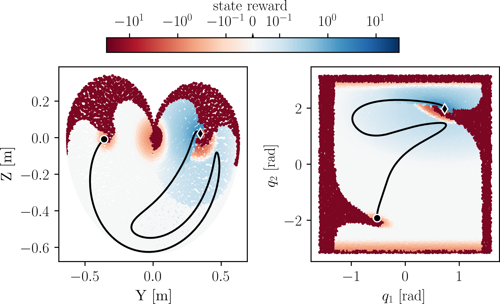

# AcroMonk: A Minimalist Underactuated Brachiating Robot

## Description
This project offers an open-source and low-cost kit to test control algorithms 
for underactuated robots. 
it implements a **brachiation robot** platform called **AcroMonk** which 
can brachiate robustly over a horizontally laid ladder bar. AcroMonk is 
the simplest possible underactuated brachiator built using one quasi-direct 
drive actuator (QDD) and passive grippers. This is the first brachiator with 
unactuated grippers that can perform more than two brachiation maneuvers. 
This project offers different control methods for trajectory stabilization 
which can be studied using the kit. Additionally, it provides a list of 
components, discusses best practices for implementation, and presents results 
from experiments with the simulator and the real system. This repository 
describes the hardware (CAD, Bill Of Materials (BOM) etc.) required to build 
the physical system and provides the software (URDF models, simulation and 
controllers) to control it.

## Reinforcement Learning
### Installation
This installation instruction assumes Ubuntu 20.04. 
We recommend using a dedicated python virtual environment, e.g. using 

    python3 -m venv path/to/your/new/venv

The training and simulation environment uses Mujoco 2.1, which has to be installed first. In order to easily 
find the package, you can add 

    export LD_LIBRARY_PATH=$LD_LIBRARY_PATH:/path/to/mujoco/folder/bin

to your .bashrc. The path is ~/.mujoco/mujoco210/bin by default (see https://github.com/openai/mujoco-py 
for more instructions). 

The requirements can be installed from the file located in 
reinforcement_learning/requirements.txt (e.g. 
<code>pip install -r requirements.txt</code>)

Hint: if you face an 

    GLEW intialization error: Missing GL version

adding 

    export LD_PRELOAD=$LD_PRELOAD:/usr/lib/x86_64-linux-gnu/libGLEW.so

to .bashrc can help.

To simulate the trained rl controller, move to the reinforcement_learning/scripts 
folder and run replay_rl_model.py. The result should be something like this:

### Training
Training a new controller is done via

    python scripts/train_rl_model.py

The parameters for training and simulation will be loade from 
the parameters.json file in /training. The reward function 
is modified by changing the weights in parameters.json under the 
"reward_setup" keyword. Rewards with a weight of 0 do not 
take effect. The reward "reward_name" expects a method 
"_reward_reward_name" of evironment/acromonk, so if you want to 
define a new reward, you have to set the weight in the parameters
file and implement the respective method in the acromonk 
environment. 

The current (dense) reward setup looks like this:

**Challenges:**
- Can you train a controller that achieves BF brachiation in one swing?
- Can you train a BF controller only using sparse rewards?
- Can you train controllers for the other atomic behaviors FB/ZB/ZF ?
