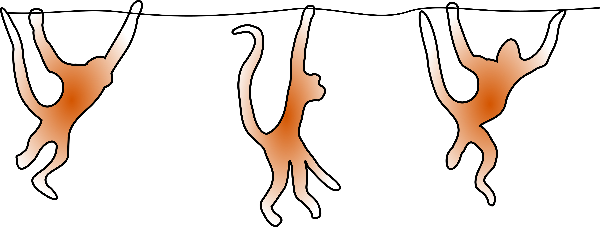

<div align="center">

# AcroMonk: A Minimalist Underactuated Brachiating Robot
</div>

<div align="center">

</div>


<div align="center">

</div>

## Description
This project offers an open-source and low-cost kit to test control algorithms 
for underactuated robots. 
it implements a **brachiation robot** platform called **AcroMonk** which 
can brachiate robustly over a horizontally laid ladder bar. AcroMonk is 
the simplest possible underactuated brachiator built using one quasi-direct 
drive actuator (QDD) and passive grippers. This is the first brachiator with 
unactuated grippers that can perform more than two brachiation maneuvers. 
This project offers different control methods for trajectory stabilization 
which can be studied using the kit. Additionally, it provides a list of 
components, discusses best practices for implementation, and presents results 
from experiments with the simulator and the real system. This repository 
describes the hardware (CAD, Bill Of Materials ([BOM](hardware/bills-of-materials.md)) etc.) required to build 
the physical system and provides the software (URDF models, simulation and controllers) to control it.


## Documentation

The dynamics of the AcroMonk is explained [here](hardware/acrm-equations.md). Additionally, [mechatronics design](hardware/testbench-description.md), [behavior generation](software/python/simulation/behavior_generation/README.md) and [control](software/python/simulation/behavior_control/README.md) for the continuous brachiation are described in their respective readme files.

* [Mechatronics Design](hardware/testbench-description.md)
* [Behavior Generation](software/python/simulation/behavior_generation/README.md)
* [Behavior Control](software/python/simulation/behavior_control/README.md)
* [Bill Of Materials (BOM)](hardware/bills-of-materials.md)

## Authors #

* [Shivesh Kumar](https://robotik.dfki-bremen.de/en/about-us/staff/shku02.html) (Project Supervisor)
* [Mahdi Javadi](https://robotik.dfki-bremen.de/en/about-us/staff/maja04/) (Hardware and Software Maintainer, Trajectory Optimization and Stabilization)
* [Daniel Harnack](https://robotik.dfki-bremen.de/en/about-us/staff/daha03.html) (Software Maintainer, Reinforcement Learning)
* [Shubham Vyas](https://robotik.dfki-bremen.de/en/about-us/staff/shvy01/) (Trajectory Optimization, Hardware Concept)
* [Daniel Pizzutilo](https://robotik.dfki-bremen.de/de/ueber-uns/mitarbeiter/dapi01.html) (Mechanical Design)
* Paula Stocco (Trajectory Optimization and Stabilization)

Feel free to contact us if you have questions about the test bench. Enjoy!

## Contributing

1. Fork it (<https://github.com/yourname/yourproject/fork>)
2. Create your feature branch (`git checkout -b feature/fooBar`)
3. Commit your changes (`git commit -am 'Add some fooBar'`)
4. Push to the branch (`git push origin feature/fooBar`)
5. Create a new Pull Request


## Safety Notes #

When working with a real system be careful and mind the following safety measures:

* Brushless motors can be very powerful, moving with tremendous force and speed. Always limit the range of motion, power, force and speed using configurable parameters, current limited supplies, and mechanical design.

* The robot must be placed in a ladder bar cage and keep at least 1-meter distance from the acromonk in case of operation.  

* Make sure you have access to emergency stop while doing experiments. Be extra careful while operating in pure torque control loop.

* The robot is equipped with an onboard Lithium Polymer battery and needs proper care and attention. Make sure that you have all the necessary information for the LiPo batteries.

## Acknowledgements #
This work has been performed in the M-RoCK project funded by the
German Aerospace Center (DLR) with federal funds (Grant Number: FKZ 01IW21002)
from the Federal Ministry of Education and Research (BMBF) and is additionally
supported with project funds from the federal state of Bremen for setting up
the Underactuated Robotics Lab (Grant Number: 201-342-04-2/2021-4-1). The fourth author acknowledges support from the Stardust Reloaded project which has received funding from the European Union’s Horizon 2020 research and innovation program under the Marie Skłodowska-Curie grant agreement No 813644.
<div align="center">

</div>

## License

This work has been released under the BSD 3-Clause License. Details and terms of use are specified in the LICENSE file within this repository. Note that we do not publish third-party software, hence software packages from other developers are released under their very own terms and conditions, e.g. Stable baselines (MIT License) and Tensorflow (Apache License v2.0). If you install third-party software packages along with this repo ensure  that you follow each individual license agreement.   

## Citation

1. Javadi et al., (2022). AcroMonk: A Minimalist Underactuated Brachiating Robot
```
@article{,
  doi = {},
  url = {},
  year = {},
  publisher = {},
  volume = {},
  number = {},
  pages = {},
  author = {},
  title = {},
  journal = {}
}
```
