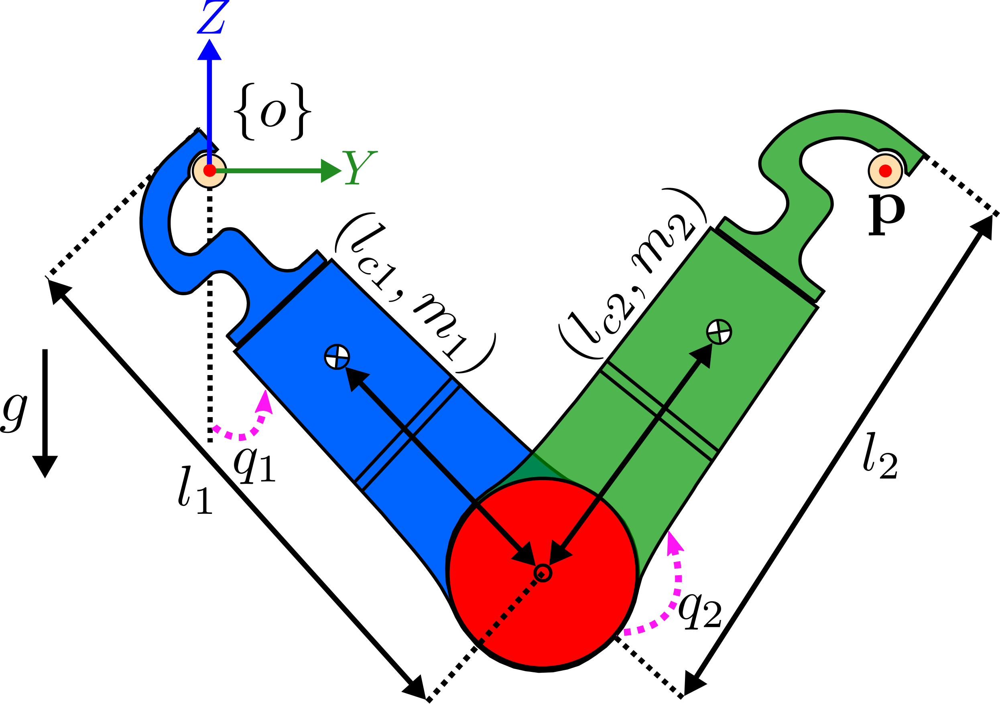

<div align="center">
# AcroMonk
</div>

<div align="center">

</div>

## Equation of Motion
The general formulation for equation of motion is shown in the following:

```math
\begin{equation*}
	\mathbf{M}(\mathbf{q}) \ddot{\mathbf{q}} +\mathbf{C}(\mathbf{q}, \dot{\mathbf{q}}) = \mathbf{\tau}_g (\mathbf{q}) + \mathbf{B} u
\end{equation*} 
```
The mass-inertia matrix $`\mathbf{M}`$ for AcroMonk is
```math
\begin{equation*} 
	\mathbf{M}(\mathbf{q}) = 
	\begin{bmatrix} I_1 + I_2 + m_2 l_1^2 +
      2m_2 l_1 l_{c2} c_2 & I_2 + m_2 l_1 l_{c2} c_2 \\ I_2 + m_2 l_1 l_{c2} c_2
      & I_2 
      \end{bmatrix}
\end{equation*}
```
with the shorthand notation $`s_1 = \sin(q_1), c_1 = \cos(q_1)`$. 
Accordingly, Coriolis matrix is:
```math
\begin{equation*}
	\mathbf{C}(\mathbf{q},\dot{\mathbf{q}}) =
	\begin{bmatrix} 
		-2 m_2 l_1 l_{c2} s_2 \dot{q}_2 & -m_2 l_1 l_{c2} s_2
		\dot{q}_2 \\ 
		m_2 l_1 l_{c2} s_2 \dot{q}_1 & 0 
	\end{bmatrix}
\end{equation*}
```

with the gravity vector as:

```math
\begin{equation*}
      \mathbf{\tau}_g(\mathbf{q}) = 
      \begin{bmatrix} 
	      -m_1 g l_{c1}s_1 - m_2 g (l_1 s_1 + l_{c2}s_{1+2}) \\ 
	      -m_2 g l_{c2} s_{1+2} 
      \end{bmatrix}
 \end{equation*}
```

and the actuation matrix is $`\mathbf{B} = [0 \quad 1]^T`$, which captures the underactuation of the system.
