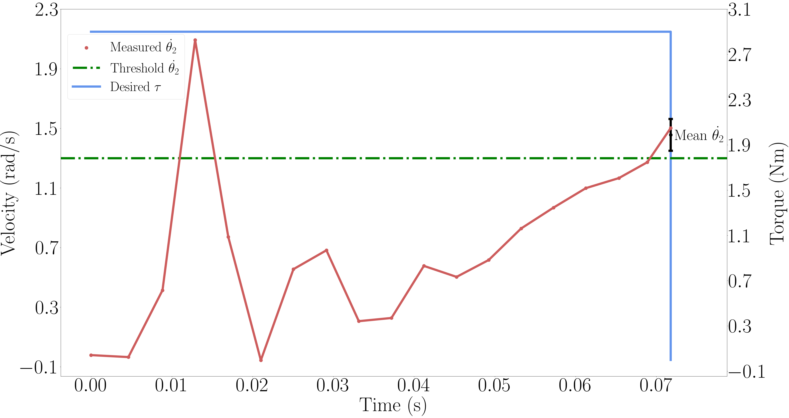

# Gripper Heuristics

The passive gripper design was empirically optimized such that the gripper’s interactions with the monkey bars can be achieved with a control heuristic on the elbow motor, which depends on contact friction characteristics and the values may vary with other setups. The counter-clockwise rotation of the motor is referenced as positive. 

## Release
To simplify the control, Back-to-Front (BF) and Front-to-Back (FB) controllers are only engaged once the swing arm releases the bar. 

### Back Release
Empirical state data $x = [q, q̇]^T$ was collected over $20$ trials at the point of controller transition and the results are depicted in the following Figure. 

Despite not releasing the hook, a peak in the velocity measurement is observed around $0.015$ seconds when a constant torque is applied. Therefore a conservative duration of $0.05$ seconds is chosen to avoid the misinterpreting of the velocity readings.
Observations show that it is possible to achieve a robust release even with a torque of $2.5\ \text{Nm}$ for $0.34\ \text{m}$ bar distance, which is lower than the $2.9\ \text{Nm}$ depicted in Figure. After this, if the elbow velocity surpasses $1.45\ \text{rad/s}$, the controller switches to BF brachiation. 

### Front Release
For FB swing, which starts with Front Release (FR), a constant torque approach was insufficient due to the different contact angles of the hook on the bar. In order to clear the front bar, an initial high negative torque and a subsequent lower sustained positive torque is applied to lift the hook groove off the bar. Similar to BR, state data was collected at this transition point.
## Catch

The catch behavior is executed at the end of each atomic sub-behavior during continuous brachiation to provide a defined rotation point for the next brachiation. This is realized by applying a negative torque for $0.1$ seconds with a magnitude of $0.8\ \text{Nm}$ . Duration and magnitude were chosen empirically such that the bar slides into the groove if the hook is slightly misplaced, but no movement is caused if the bar is already resting in the groove.