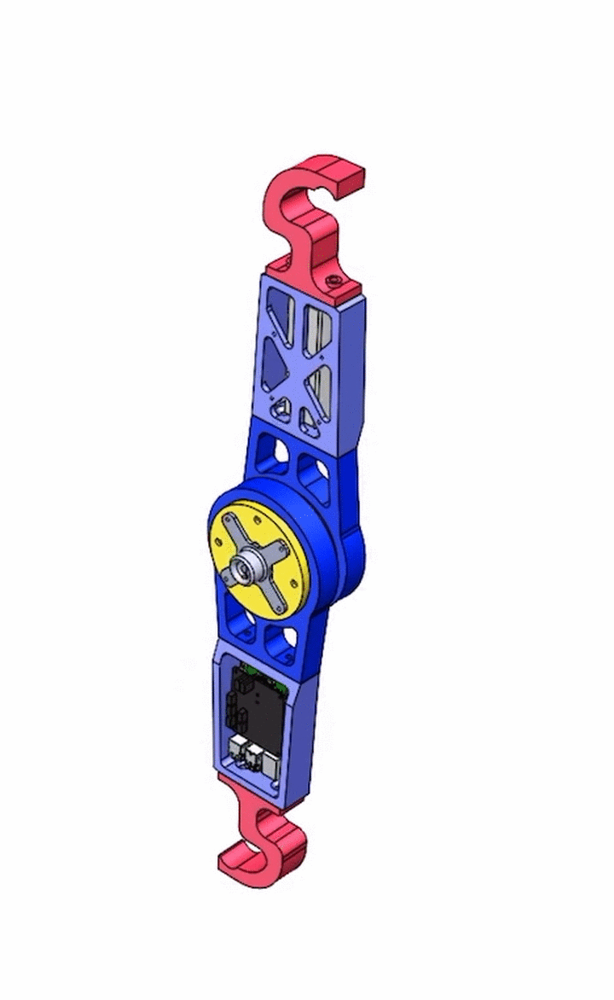

# Mechatronics Design

## Mechanics
The main idea for the design of the AcroMonk is to have a portable and robust agile robot with a minimum effort for the modification. 
A modular design is proposed that uses 3D printing technology for ease of reproducibility. 
Overall, the structure consists of six unique 3D-printed parts highlighted with different colors that are connected by screw-nut fasteners for easy assembly, with compartments for electronics, a battery, counterweights, and cable guides. The innovative gripper design of the AcroMonk makes him the first brachiator that can brachiate continuously with the passive gripper.

## Electronics
The schematic of the electrical diagram is shown in the following figure and components are described in individual subsections.

### Battery
All electronics of the AcroMonk are powered by a LiPo battery with the following technical data:
- Capacity: $6\text{S}\ 1200 \text{ mAh}$ 
- Voltage: $22.2\text{V}$
- Continuous Discharge: max. $30\text{C } (36\text{A})$
- Burst Discharge:max. $60\text{C } (72\text{A})$
- Power: $26.64 \text{ WH}$

### Raspberry Pi 
A Raspberry Pi 4 Model B is used for the onboard computer, providing wireless communication capability. 
- [Setup guide](wireless-communication.md)
### pi3hat
[Mjbots pi3hat](https://mjbots.com/products/mjbots-pi3hat-r4-4b) is a daughterboard for the Raspberry Pi, and sits on top of it by connecting through the $40$ pin GPIO interface. The $\text{XT}30\text{-M}$ power connector on pi3hat enables the powering of the Raspberry Pi, and also provides CAN interfaces for communication with the actuator ([mjbots qdd 100 servo](https://mjbots.com/collections/servos-and-controllers/products/qdd100-beta-3)) and IMU sensor. 

In order to read IMU data, one can use [pi3hat_tools](https://github.com/mjbots/pi3hat/) library provided by mjbots. 
- [IMU reading](https://github.com/mjbots/pi3hat/blob/master/lib/python/examples/imu_example.py)

### Actuator

A [qdd100 beta 3 servo](https://mjbots.com/collections/servos-and-controllers/products/qdd100-beta-3) is used as an actuator for the AcroMonk. 
Here are the useful links for documentation and also setting up the mjbots servo motor:
- [Documentation](https://github.com/mjbots/moteus)
- [Setup guide](https://www.youtube.com/watch?v=HHCBohdrCH8)

### Emergency Stop
To have the authority to disable the motor in case of the undesired behavior, a remote emergency stop is designed. A relay, diode, and a $30 \text{A}$ electronic switch are employed to disconnect the power. The triggering command is provided by a joystick that connects the electronic switch with an onboard receiver, which is powered by a buck converter.
A series combination of Varistor(voltage-dependant-resistor) and a resistor component is used to protect the buck conrverter from high-frequency voltage fluctuations.

# Mechatronics Integration
Here is the final integration of the AcroMonk.

