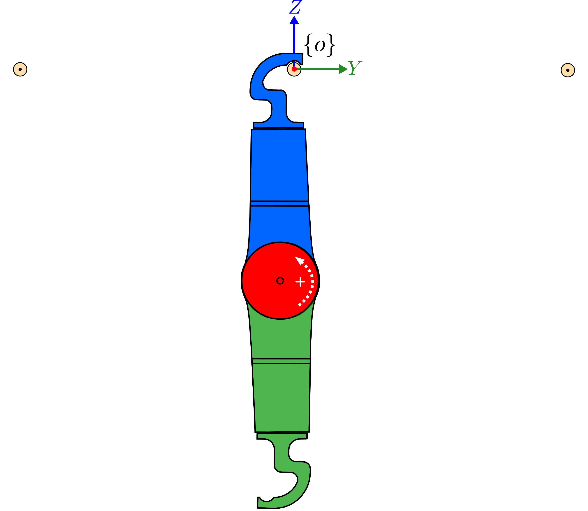
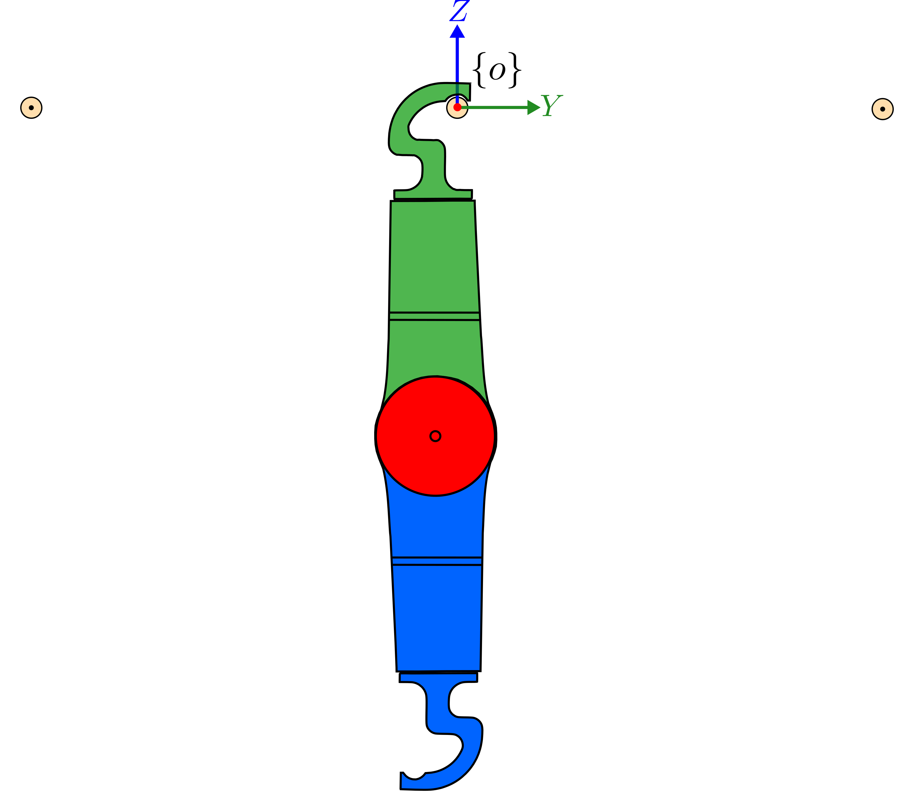
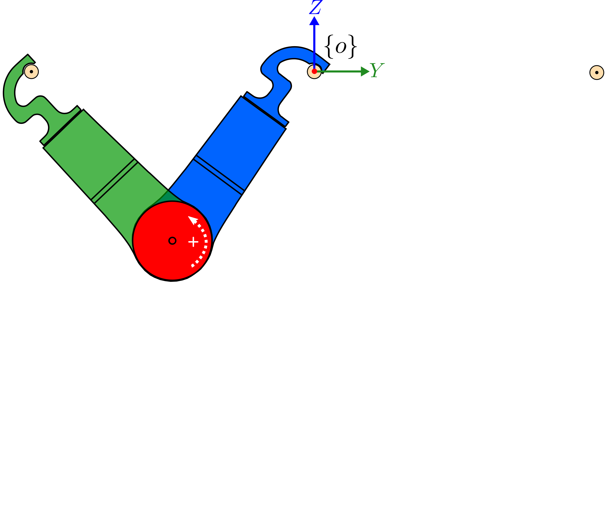
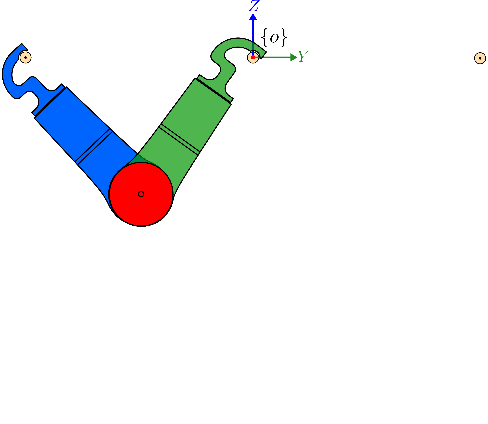

# Trajectory Stabilization with AcroMonk
The following instructions assume that the scripts will be executed on the Raspberry Pi. The required packages that need to be installed on the Raspberry Pi are provided in the [requirement.txt](requirements.txt).

A Makefile is provided in the following folder for the automatic execution of the robust forward brachiation using TVLQR and PD controller:

`software/python/real_system/Makefile`

The following parameters can be used for arbitrary behavior:

```
TEST          : stabilizing controller (pd, tvlqr), default=pd
FILE          : swing trajectory (BF trajectory in data/trajectories/closed_loop folder), default=BF_tvlqr.csv
MOTOR_ID      : mjbots servo id, default=7
BUS_NUMBER    : bus number on pi3hat, default=4
FILE_RECOVERY : recovery trajectory (Recovery trajectory in data/trajectories/closed_loop folder), default=ZF_tvlqr.csv
INIT_CONF     : initial configuration of the AcroMonk (1, 2), default=1: description provided in initial configuration section of this README
NBRACH        : number of brachiation maneuvers, default=1
```
for example:

```
make NBRACH=3  TEST=tvlqr
```
executes 3 brachiation motions with TVLQR stabilization. After typing the execution command on the terminal, the initialization of the parameters and IMU will be started. If it returns no error in the terminal, you need to type in `y` if ready for the execution on the real system. 
The plots and csv file are saved in the `results/real_system` folder. 

## Initial configuration
The zero offset coordinate of the motor will be set when the motor is energized. It is of great importance that the energization takes place when the robot has a hanging arm and $`\theta_2=0`$. The following table provides the overview of the possible initialization of the robot for the execution of the script. The arm with the computing compartment, i.e. Raspberry Pi and IMU, is shown in `green`.
<div align="center">

|INIT_CONF=1|INIT_CONF=2|
|:--:|:--:|
|||
|||

</div>
Here is the main difference between configurations:

- `INIT_CONF=1`: IMU swings with the arm and the motor axis is outward, i.e. positive rotation is counter-clockwise.
- `INIT_CONF=2`: IMU arm is attached to the bar and the motor axis is pointing towards the page, i.e. positive rotation is clockwise.

## Robust Forward Brachiation with AcroMonk
For the robust forward brachiation, if you start the script's execution with zero configuration and then press `y`, the state machine detects the hanging position of the arm and starts with the recovery mode `ZF` and further continues with the rest of the brachiation maneuvers. However, if you place the robot in the `both arms attached` configuration after the initialization phase from zero configuration, and then press `y`, the execution will be started from the `BF` maneuver and continues with the brachiation.

## Atomic Behavior with AcroMonk
The following instructions allow the execution of the atomic behaviors `ZF, BF, ZB, FB` on the real system:
### BF
Place the robot in the initial position that both arms are attached to the bars and type one of the following commands depending on the `INIT_CONF`:
```
make 
```
or
```
make NBRACH=2 INIT_CONF=2
```

### ZF
Place the robot in the hanging configuration and type one of the following commands depending on the `INIT_CONF`:
```
make
```
or
```
make NBRACH=2 INIT_CONF=2
```

### ZB
Place the robot in the hanging configuration and type one of the following commands depending on the `INIT_CONF`:
```
make FILE_RECOVERY=ZB_pd.csv
```
or
```
make NBRACH=2 INIT_CONF=2 FILE_RECOVERY=ZB_pd.csv
```

### FB
To execute the FB maneuver, you need to execute the script in the following folder `software/python/real_system/FB_PD/tests/FB_brachiation.py`.

**Notes and cautions**

- This script works only with the `INIT_CONF=1`
- The following steps need to be taken for the real system test:
    - Place the robot in the hanging zero configuration 
    - Type in the terminal: ```sudo -E python3 FB_brachiation.py``` and if it returns no error, type in `y` and press `Enter`
    - The script waits for 10 seconds to let the operator attach the IMU arm to the front bar


## Forward Brachiation using Reinforcement Learning
A [guide](BF_Reinforcement_Learning/README.md) is provided for execution of Reinforcement learning algorithm on the AcroMonk. 
