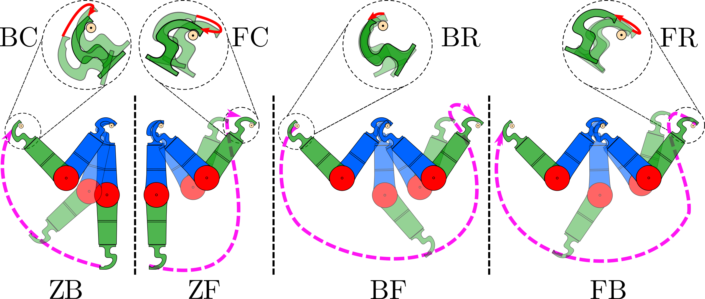
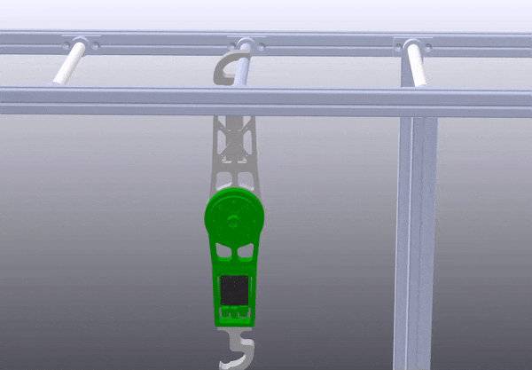
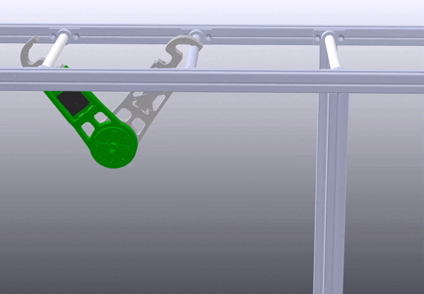
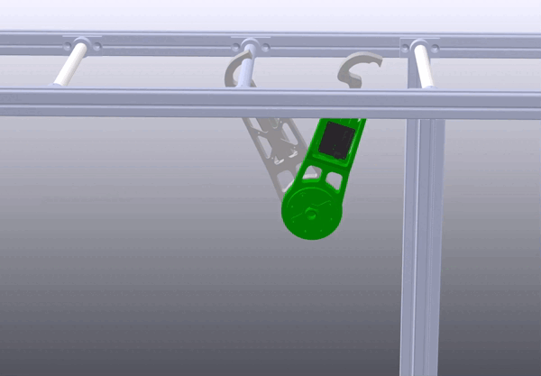
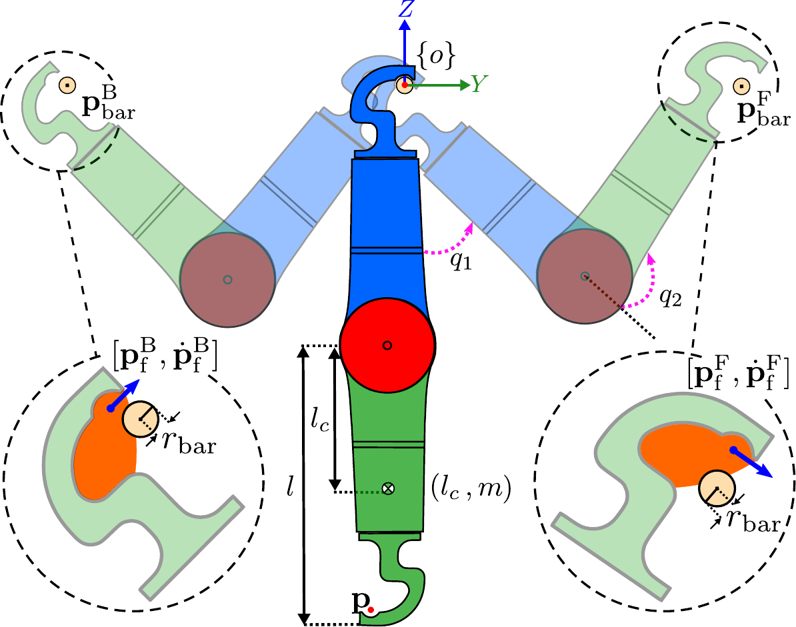

# Behavior Generation

Considering three fixed points for the robot as the following:

- Z (single support, hanging)
- B (double support with backward bar)
- F (double support with forward bar).

## Atomic Behaviors
Inspired by the typical brachiation of a monkey, the following four atomic behaviors can give rise to robust bidirectional
brachiation over horizontal bars.

## AcroMonk's Configuration for Atomic Behaviors
The unique gripper design offers a large region of attraction, shown in orange color, for grasping a target bar and a well-defined pivot point for the swing maneuvers. The passive gripper imposes a constraint on grasping configuration, which plays a vital role in the robot's final configuration. 

## Behavior Generation Methods

The atomic behaviors are generated using the following methods:
- Trajectory Optimization with [Direct Collocation](trajectory_optimization/direct_collocation/README.md) (ZF, ZB, FB, BF)
- [Reinforcement Learning](reinforcement_learning/README.md) (BF)