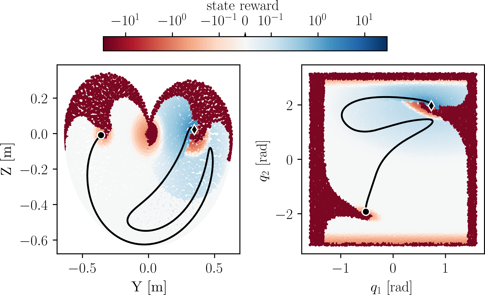

# Reinforcement Learning
## Training a Controller
Training a new controller is done via

    python scripts/train_rl_model.py

The parameters for training and simulation will be loaded from 
the parameters.json file in /training. The reward function 
is modified by changing the weights in parameters.json under the 
"reward_setup" keyword. Rewards with a weight of 0 do not 
take effect. The reward "reward_name" expects a method 
"_reward_reward_name" of environment/acromonk, so if you want to 
define a new reward, you have to set the weight in the parameters
file and implement the respective method in the acromonk 
environment. 

The current (dense) reward setup looks like this:

The trained controller will be saved in 
{your_project_root}/data/trained_controllers under a folder with 
the current time, along with a copy of the used 
parameters for reproducibility. You can visualize your trained 
controller by changing the path in scripts/replay_rl_model.py in line 15. 
A specific checkpoint can be chosen by the evaluation 
steps, e.g. 
<code>rl_checkpoint = '10000'</code>. 
(default 'best' uses the best performing agent). 

---
**Challenges:**
- Can you train a controller that achieves BF brachiation in one swing?
- Can you train a BF controller only using energy-based reward?
- Can you train a BF controller only using sparse rewards?
- Can you train controllers for the other atomic behaviors FB/ZB/ZF?
---