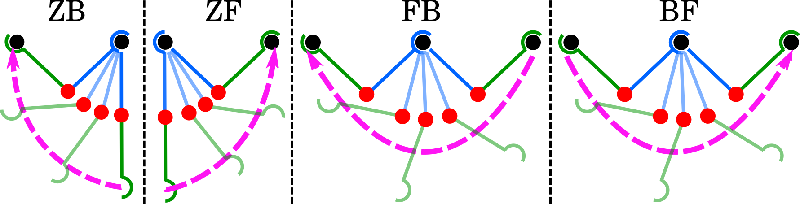
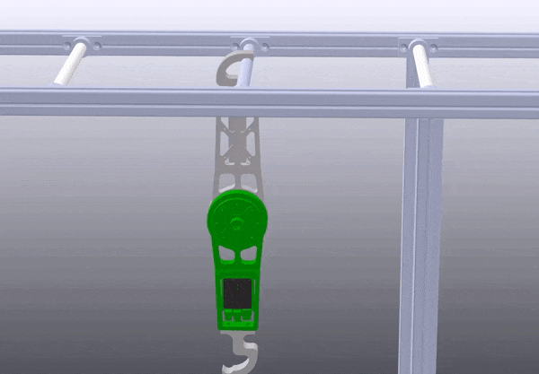
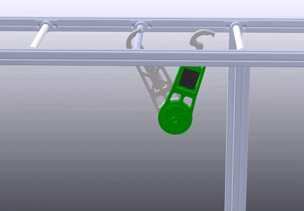
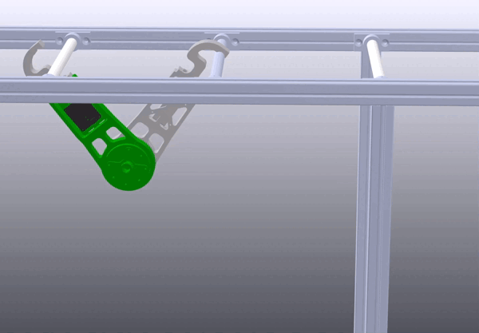
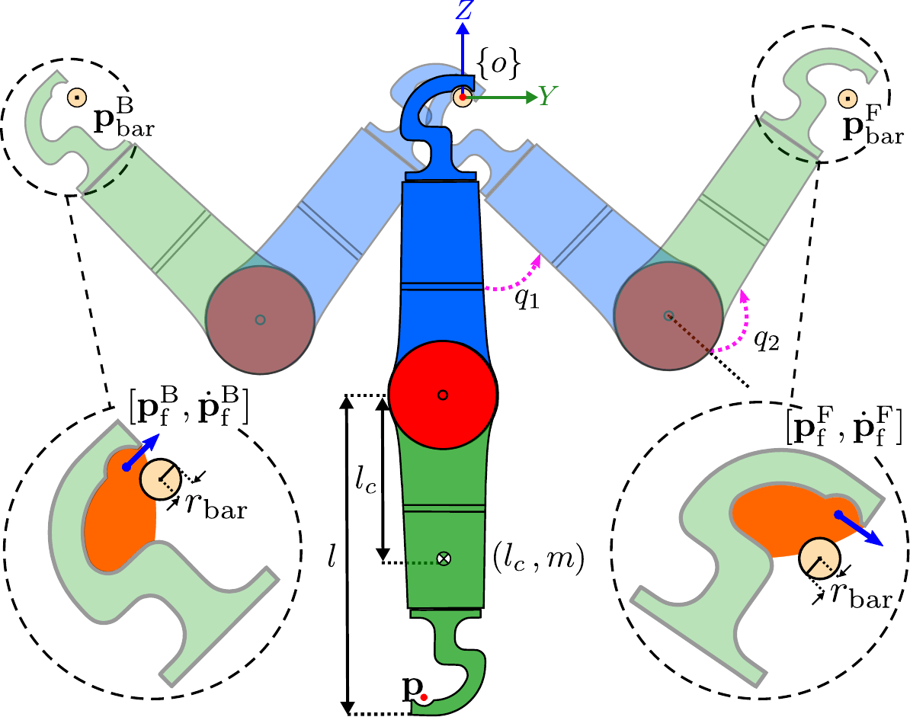

# Trajectory optimization using direct collocation

## Theory

Direct collocation is an approach from ***collocation methods*** , which transforms the optimal control problem into a mathematical programming problem. The numerical solution can be achieved directly by solving the new problem using sequential quadratic programming [[1]](https://arc.aiaa.org/doi/pdf/10.2514/3.20223)[[2]](http://underactuated.mit.edu/trajopt.html).

## Atomic behaviors
Considering three fixed points for the robot as the following:
- Z (single support, hanging)
- B (double support with backward bar)
- F (double support with forward bar)


the following figure depicts the general possibilities for the robot's motion.

<div align="center">

</div>

<div align="center">




</div>

## AcroMonk's Configuration for Atomic Behaviors
The unique gripper design offers a large region of attraction, shown in orange color, for grasping a target bar and a well defined pivot point for the swing maneuvers. The passive gripper impose a constraint on grasping configuration, which plays a vital role in robot's final configuration. 
<div align="center">

</div>


## Formulation

The continuous time trajectory optimization problem of the AcroMonk is shown in the following:
```math
\begin{align*}
		&\min_{\mathbf{x}, u} W T + \int_{0}^{T} \left(\mathbf{x}^T \mathbf{Q} \mathbf{x} + u^T R u\right) dt  \\
		&\mathrm{subject\ to}:\\
	    &\dot{\mathbf{x}} = \mathbf{f}(\mathbf{x}, u)\\
	    &|\mathbf{x}| \leq \mathbf{x}_\text{lim}, \ \ |u| \leq u_\text{lim}\\
	    &\mathbf{x}(0) = \mathbf{x}_0, \ \ \ \mathbf{x}(T) = \mathbf{x}_f\\
	    &|| \mathbf{p} - \mathbf{p}^\text{F}_\text{bar} || > r_\text{bar}, \ \  || \mathbf{p} - \mathbf{p}^\text{B}_\text{bar} || > r_\text{bar}
\end{align*}
```

- $`{\bf{x}} = {{[\theta_1(.), \theta_2(.), \dot{\theta_1}(.), \dot{\theta_2}(.)]}}^T`$: Angular positions and velocities are the states of the system 

- $`u`$: Input torque of the system applied by motor

- $`{\bf{x}}_0:`$ Initial state constraint

- $`{\bf{x}}_F:`$ Terminal state constraint

- $`|| \mathbf{p} - \mathbf{p}^\text{F}_\text{bar} || > r_\text{bar}, \ \  || \mathbf{p} - \mathbf{p}^\text{B}_\text{bar} || > r_\text{bar}`$: Collision avoidance with bars

- $`WT`$: Final cost to minimize total trajectory time $`T`$ with weight $`W`$ 

- $`\mathbf{x}^T \mathbf{Q} \mathbf{x}`$: State regularization cost with $`\mathbf{Q}=\mathbf{Q}^T \succeq 0`$ as state regulization term

- $`l(u) = u^TR u`$: Running cost with $`R`$ as input weight

- $`\mathbf{f}(\mathbf{x}, u)`$: [Nonlinear dynamics of the AcroMonk](../../../../../hardware/acrm-equations.md) considered as equality constraint

## Dependencies

The trajectory optimization using direct collocation for all the atomic behaviors is accomplished by taking advantage of [Drake toolbox [3]](https://drake.mit.edu/).

## References
[[1] Hargraves, Charles R., and Stephen W. Paris. "Direct trajectory optimization using nonlinear programming and collocation." Journal of guidance, control, and dynamics 10.4 (1987): 338-342](https://arc.aiaa.org/doi/pdf/10.2514/3.20223)

[[2] Russ Tedrake. Underactuated Robotics: Algorithms for Walking, Running, Swimming, Flying, and Manipulation (Course Notes for MIT 6.832).](http://underactuated.mit.edu/)

[[3] Model-Based Design and Verification for Robotics](https://drake.mit.edu/).
